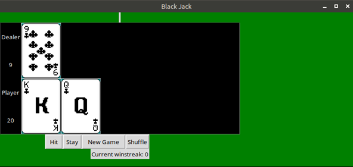

# Simple-Python-Blackjack

**Pică Eduard-Ionuț**  
Group: 1221A  
Blackjack with Interface in Tkinter

## Introduction
This document provides detailed information about the functionality and structure of the Blackjack game developed using Python's Tkinter library. The game simulates a standard Blackjack game where the user plays against the dealer (computer).

## Game Overview
Blackjack is a popular card game where the goal is to have a hand value as close to 21 as possible without exceeding it. Face cards (Kings, Queens, and Jacks) are worth 10 points, Aces can be worth 1 or 11 points, and all other cards are worth their face value. The player competes against the dealer, who also tries to get as close to 21 as possible.

## User Interface
The main window of the game is shown below.


The main window of the game contains several key elements:
- **Title**: The window title displays "Blackjack".
- **Player Area**: Shows the player's cards and current score.
- **Dealer Area**: Shows the dealer's cards and current score (initially, one card is hidden).
- **Control Buttons**: "Hit", "Stay", "New Game", and "Shuffle".

### Buttons
- **Hit**: Draws another card for the player. If the player's total exceeds 21, they lose the game.
- **Stay**: Ends the player's turn. The dealer then draws cards until their total is 17 or higher. The outcome of the game is then determined.
- **New Game**: Resets the game, dealing new cards to both the player and the dealer.
- **Shuffle**: Shuffles the deck of cards to ensure randomness.

## Game Mechanics

### Initialization
Upon starting the game, the deck is shuffled, and two cards are dealt to both the player and the dealer. The player's cards are displayed face-up, while one of the dealer's cards is hidden.

### Player's Turn
The player begins their turn with the option to "Hit" or "Stay":
- **Hit**: The player receives another card. If the player's total exceeds 21 (a "bust"), the game ends with a loss for the player.
- **Stay**: The player's turn ends, and the dealer's turn begins.

### Dealer's Turn
When the player stands, the dealer draws additional cards until their total is at least 17. If the dealer busts (exceeds 21), the player wins. If neither bust, the closest total to 21 without going over wins.

### Game End
The game ends when either the player busts, the dealer busts, or both have stood. The game then compares the totals to determine the winner and increment the winstreak counter when the player wins and resets it to 0 when the player loses. Draws (ties) don’t affect the winstreak counter.

## Code Structure

### Main Script
The main script initializes the game, creates the Tkinter window, and sets up the event handlers for the buttons. The primary components include:
- **Deck Management**: Handling the deck of cards, including shuffling and dealing.
- **Hand Management**: Representing a hand of cards, calculating the total value, and determining if the hand is a bust.
- **Game Logic**: Managing the game logic, including player and dealer actions, and determining the outcome of the game.

### Key Functions

- **enable_buttons(bool)**  
  Enables or disables the control buttons based on the boolean value passed.

- **load_images(card_images)**  
  Loads card images from the specified directory and stores them in the card_images list.

- **_deal_card(frame)**  
  Deals the next card from the deck, displays it in the specified frame, and returns the card.

- **score_hand(hand)**  
  Calculates the score of a given hand, adjusting for Aces as necessary to avoid busting.

- **deal_dealer()**  
  Handles the dealer's turn, drawing cards until the dealer's score is at least 17. Determines and displays the game outcome.

- **deal_player()**  
  Handles the player's action when they choose to hit. Adds a card to the player's hand and checks for busts or automatic wins.

- **initial_deal()**  
  Deals the initial cards to both the player and the dealer, setting up the game state.

- **new_game()**  
  Resets the game state, reinitializing the hands and starting a new game.

- **shuffle()**  
  Shuffles the deck of cards to ensure randomness.

- **play()**  
  Starts the game by dealing the initial cards and entering the Tkinter main loop.

## Example Usage
To start the game, run this script inside the game file directory:
```python3 blackjack.py```
The Tkinter window will open, and the game will begin with initial cards dealt to both the player and the dealer. Use the "Hit" and "Stay" buttons to play the game.

## Conclusion
This Blackjack game provides an interactive and enjoyable way to play Blackjack against a computer dealer. The Tkinter interface makes the game visually engaging and easy to use. The underlying game logic ensures a fair and challenging experience.
